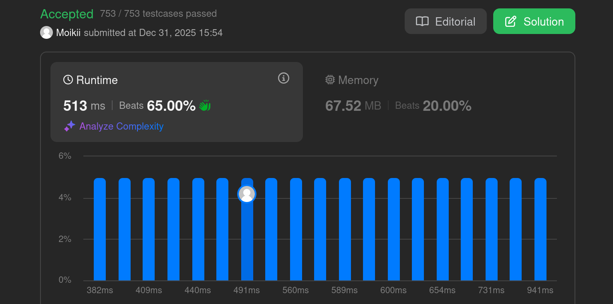

# 3508 - Implement Router

 The problem can be found [here](https://leetcode.com/problems/implement-router/description/).

## Problem Summary
The task is to design a data structure that can efficiently manage data packets in a network router. Different methods have to be implemented to handle incoming packages and forward packages. Additionally a method that counts packets with a given destination still in the queue has to be implemented.

## Approach
The problem itself is pretty straightforward. The main difficulty lies implementing it efficiently.

Since the data is sorted, binary search (bisection) was the first thing that came to my mind. I used the existing methods in python for this, rather than implementing it by myself from scratch.

However, the initial implementation resulted in a *Time Limit Exceeded* error on LeetCode, meaning that more optmization was needed.

I stumbled across the datatype `deque`, as FIFO operations are more efficient there than repeatedly removing the first element of a list. While this improved removal performance, `deque` performs poorly when accessing arbitrary indices, which slows down the bisection.

In the end, I ended up with a `deque` to keep track of all the packets, a `set` to check duplicate packages efficiently and a `dict` where each key is a destination that points to a list of timestamps and a *start-index* that changes the start of the list, rather than removing elements from the list itself. So we can keep the time stamps as a list for efficient bisection, but do not have to remove elements from the front.

## Submission Result

